# 🚀 SajiloBihe Event Venue Booking - Mobile App 📱

Welcome to the **SajiloBihe Event Venue Booking** mobile application! This app simplifies venue booking for events like weddings, birthdays, and parties while offering a powerful admin dashboard for managing bookings, venues, and user inquiries.

Built with **Flutter & Dart**, this app follows **Clean Architecture** and the **MVVM** design pattern for a scalable and maintainable codebase.

---

## 🛠️ Tech Stack

- **📱 Mobile Framework:** Flutter (Dart)
- **🗄️ Local Storage:** Hive (Works offline seamlessly)
- **🔗 Backend:** Node.js, Express, MongoDB
- **🎯 Architecture:** Clean Architecture (Scalable & Maintainable)
- **📌 State Management:** BLoC
- **⚡ Agile Methodology:** Weekly sprints for iterative improvements

---

## 🌟 Features

### 👥 **For Users**

- 🔐 **Login & Register** – Secure authentication for users.
- 🏠 **Homepage** – Browse the best event venues.
- 🔍 **Search & Filter** – Find venues based on location, price, and availability.
- 📅 **Book Appointments** – Easily schedule event bookings.
- 📩 **Send Contact Messages** – Directly reach out for inquiries.
- 🛠 **Customize Profile** – Edit personal details and preferences.
- ℹ️ **About Us** – Learn more about SajiloBihe.
- 📜 **Terms & Conditions** – Understand policies before booking.

### 🔑 **For Admin**

- 🎛️ **Admin Dashboard** – Track business performance with insights.
- ➕ **Add Venue** – Seamlessly upload new venue listings.
- 🏛️ **Manage Venues** – Edit or remove venue details.
- 📦 **Manage Orders** – View, approve, or cancel user bookings.
- 📩 **Manage Contact Requests** – View and respond to inquiries.

---

## 📸 App Screenshots

### 🏠 Splash Screen

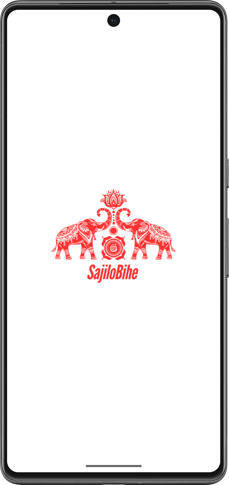

### 🚀 Onboarding Screen

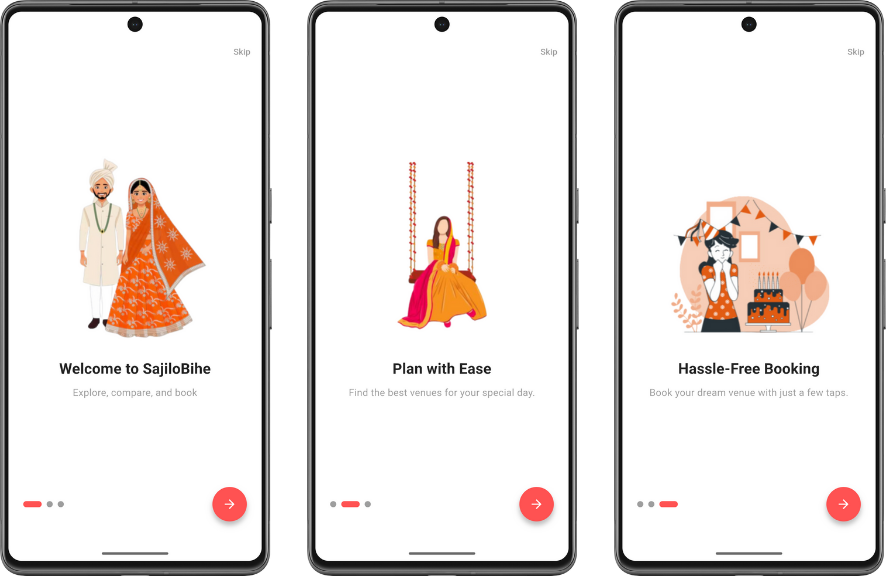

### 🔐 Login Screen

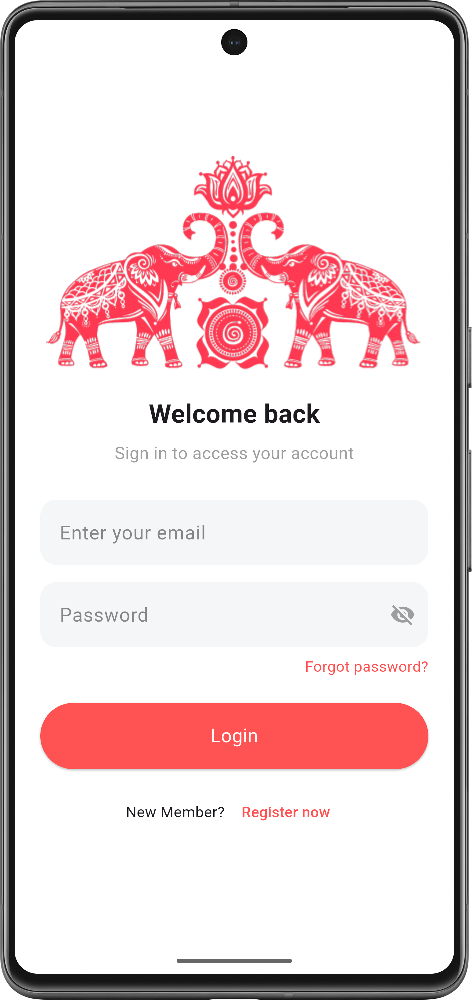

### 📝 Registration Screen

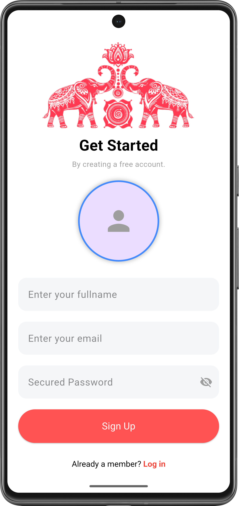

### 🏠 Home Page

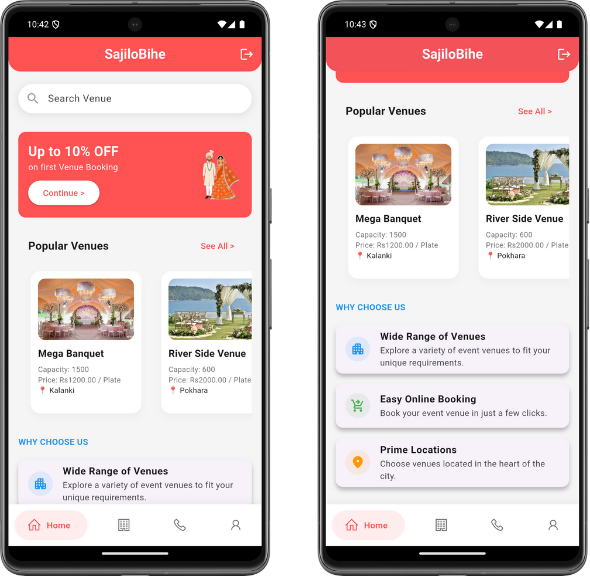

### 🏛️ Venue Screen

### 📖 Venue Detail Page

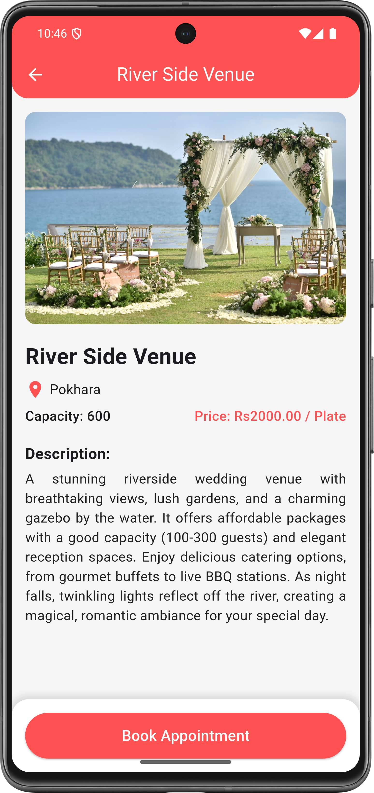

### 📅 Booking Display Screen

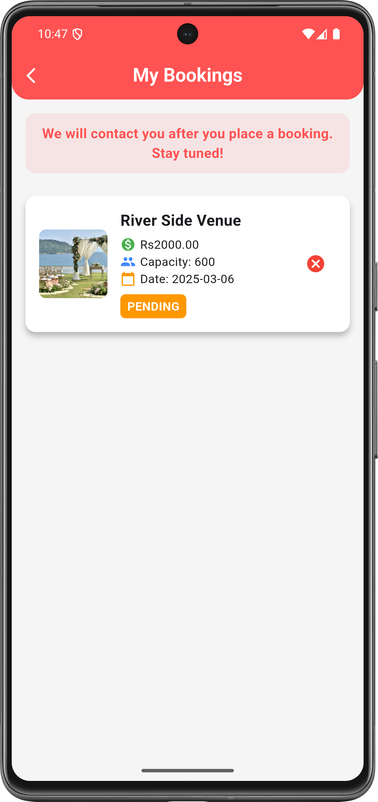

### 📩 Contact Screen

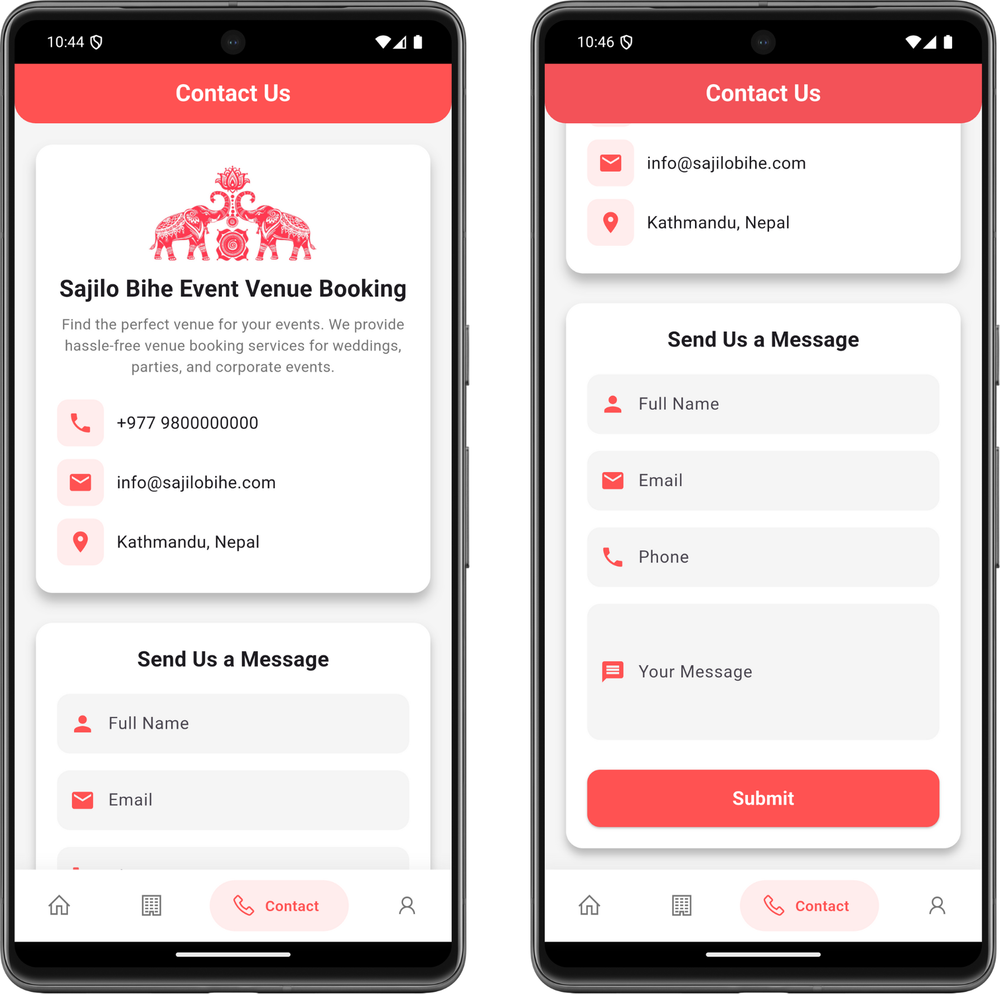

### 🛠 Profile Screen

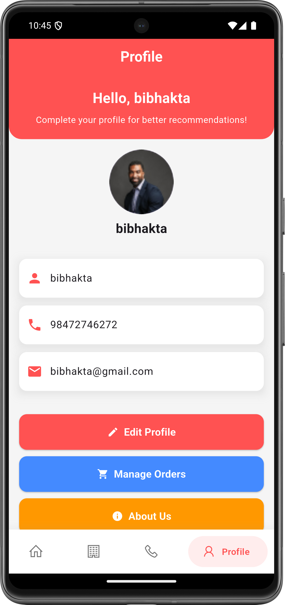

### ℹ️ About Us

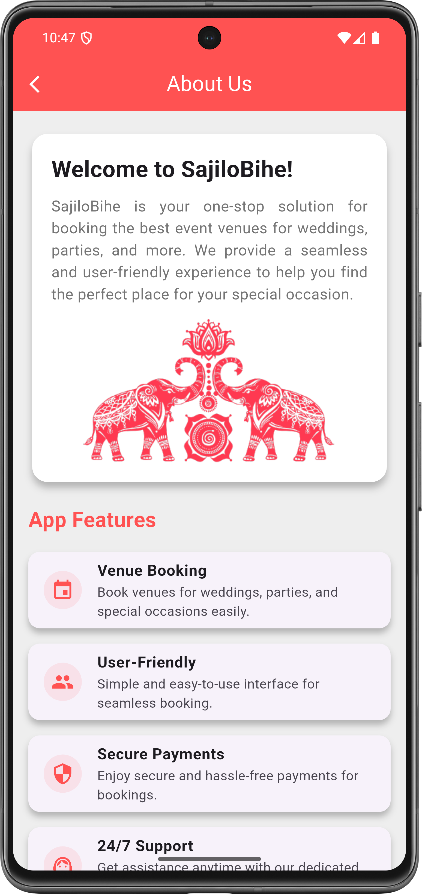

### 📜 Terms and Conditions

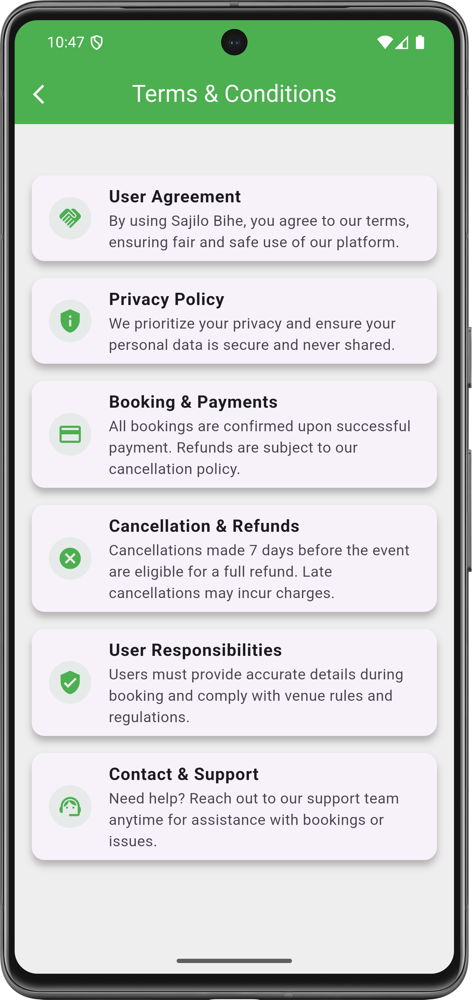

### 🎛️ Admin Dashboard

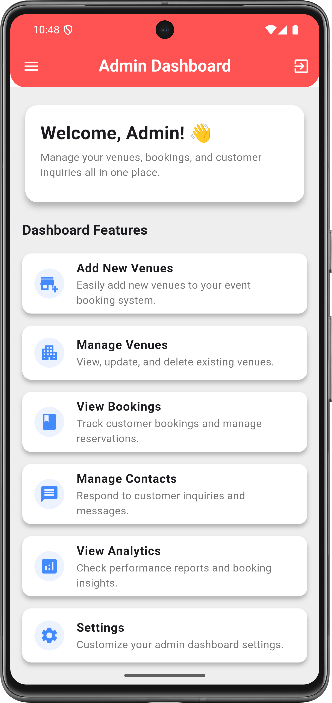

### ➕ Add Venue

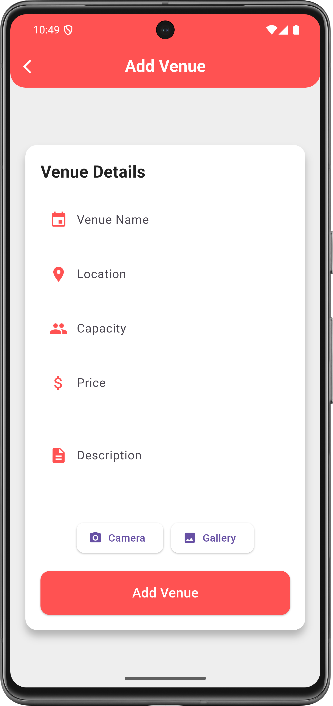

### 🏛️ Manage Venue

### 📩 Manage Contact

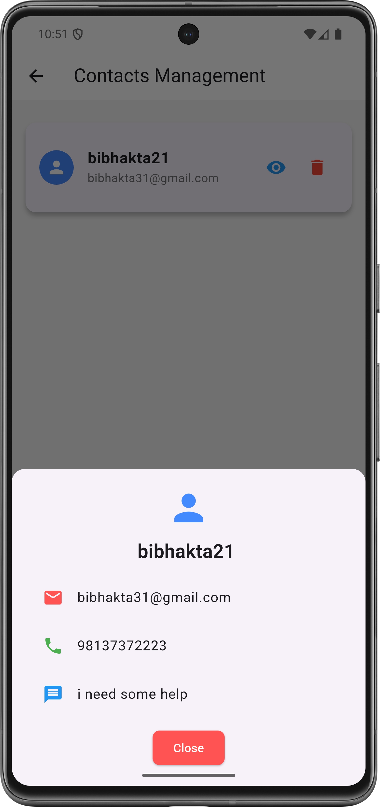

### 🚫 Manage Booking

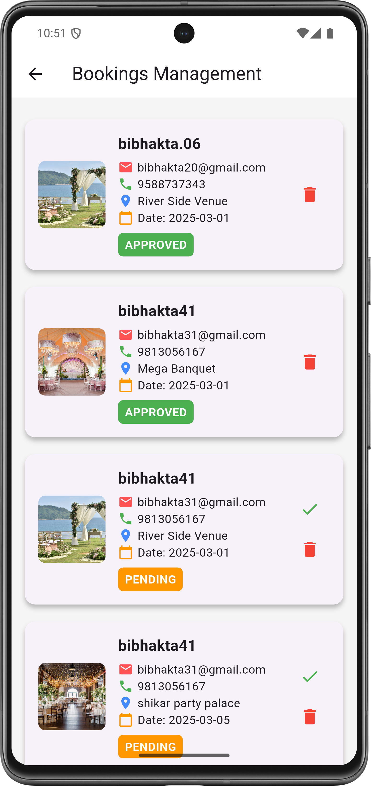

### 🏆 Admin Drawer

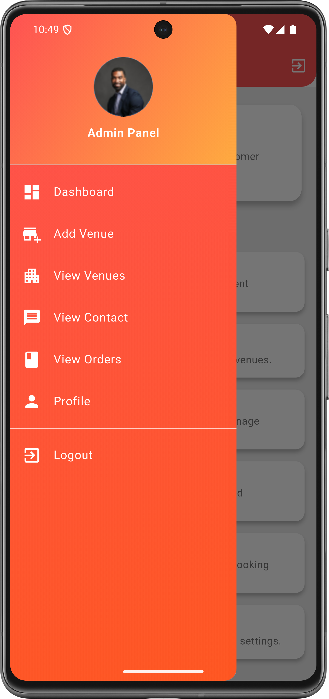

---

## 📞 Contact

For any questions, suggestions, or contributions, please feel free to reach out:

📧 **Email:** bibhaktalamsal8@gmail.com  
📺 **YouTube:** [Watch Demo](https://www.youtube.com/watch?v=OafxBjYu4Ks)  
🎨 **Figma:** [View UI Design](https://www.figma.com/design/J3VxNASblX8E9ga4Uy57xO/sajiloBihe?node-id=0-1&t=nZmUGDJuroY3bJKs-1)
